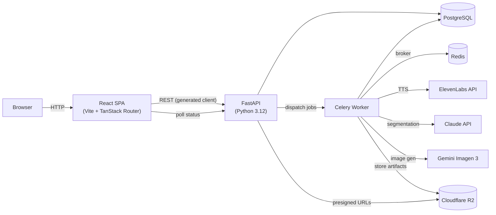
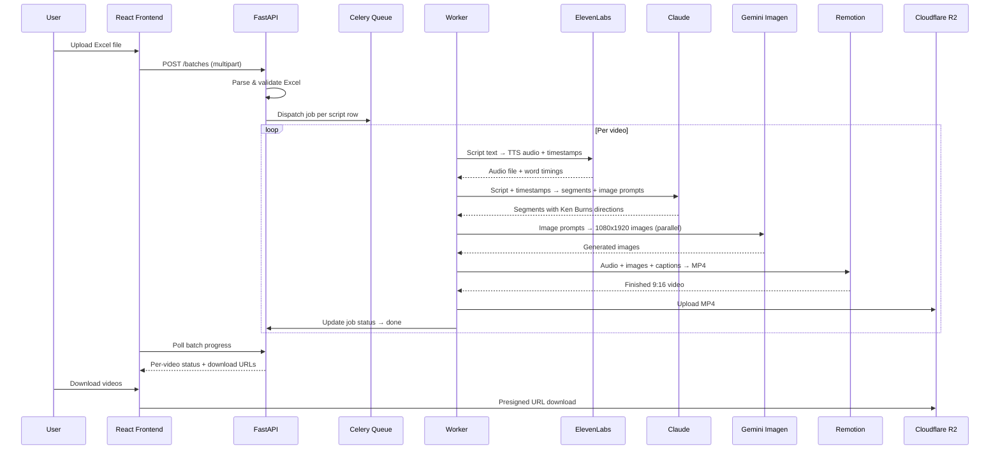

# Architecture Overview

## System Architecture



## Video Pipeline Flow



## Monorepo Structure

```
lead-alliances-video-pipeline/     # Root (pnpm workspaces + Turborepo)
├── apps/
│   ├── react/                     # React SPA (Vite + TanStack Router)
│   │   └── src/
│   │       ├── routes/            # TanStack Router file-based routes
│   │       ├── components/        # React components
│   │       └── lib/               # Utilities, API client
│   ├── api/                       # FastAPI backend (Python 3.12)
│   │   ├── api/                   # HTTP layer (routers, models, schemas, crud)
│   │   │   ├── core/              # Base models, CRUD, health routes
│   │   │   ├── videos/            # Video pipeline domain
│   │   │   └── deps/              # Dependencies (db, storage, celery, sentry)
│   │   ├── __tests__/             # pytest tests
│   │   └── migrations/            # Alembic migrations
│   ├── mkdocs/                    # Developer documentation
│   └── storybook/                 # UI component dev
├── packages/
│   ├── ui/                        # shadcn/ui (Radix + Tailwind)
│   ├── analytics/                 # PostHog
│   ├── api-client/                # Generated FastAPI client (Orval)
│   └── sentry/                    # Shared Sentry config
└── tooling/                       # Shared configs (TS, ESLint, Prettier)
```

## Where to Put New Code

| You want to... | Put it in... |
|----------------|-------------|
| Add a new page/route | `apps/react/src/routes/` |
| Add a React component | `apps/react/src/components/{feature}/` |
| Add a custom hook | `apps/react/src/hooks/` |
| Add a backend endpoint | `apps/api/api/{module}/routes.py` |
| Add a backend model | `apps/api/api/{module}/models/` |
| Add a backend schema | `apps/api/api/{module}/schemas.py` |
| Add a CRUD class | `apps/api/api/{module}/crud.py` |
| Add a pipeline task | `apps/api/api/deps/tasks.py` |
| Add a shared UI component | `packages/ui/src/components/` |
| Add a backend unit test | `apps/api/__tests__/` |
| Add an E2E test | `apps/react/e2e/` |

## Authentication

Simple shared-password auth for the marketing team:
- Single password set via `APP_PASSWORD` env var
- No individual user accounts
- Session persists via cookie/token
- All API endpoints reject unauthenticated requests

## Database

Single PostgreSQL database (SQLAlchemy async):

| Table | Purpose |
|-------|---------|
| `videos` | Video records (script, status, stage, output URL) |
| `shots` | Segments per video (text, image prompt, Ken Burns config, timing) |

## Storage (Cloudflare R2)

- Intermediate artifacts stored per pipeline stage
- Finished MP4s served via presigned URLs
- Auto-cleanup after 7 days (R2 lifecycle rules or Celery beat)
- Batch records retained in DB after file expiry (marked as expired)

## Key Technologies

| Layer | Tech |
|-------|------|
| Frontend | React + Vite + TanStack Router |
| UI Library | shadcn/ui (Radix + Tailwind) |
| Backend | FastAPI (Python 3.12) |
| Database | PostgreSQL + SQLAlchemy 2.0 (async) |
| Task Queue | Celery + Redis |
| Storage | Cloudflare R2 |
| TTS | ElevenLabs API |
| Script Analysis | Claude claude-sonnet-4-6 |
| Image Generation | Gemini Imagen 3 |
| Video Assembly | Remotion |
| API Client | Orval (generated) |
| Monorepo | Turborepo + pnpm |
| Deployment | Docker on VPS |
