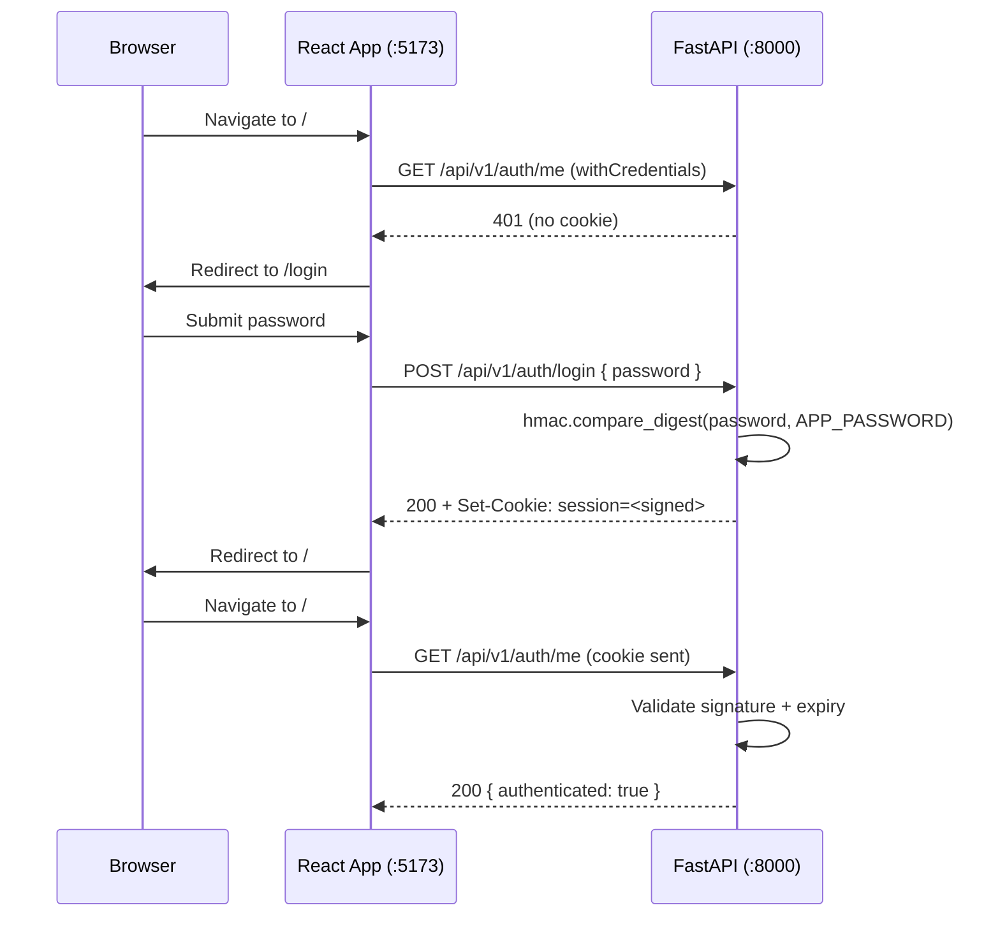

# Authentication

## Overview

Shared-password authentication for the marketing team. No individual user accounts — a single `APP_PASSWORD` environment variable protects all routes. Sessions are managed with `itsdangerous` signed httpOnly cookies.

**Why not JWT?** No user table, no token refresh logic, no extra dependencies. `itsdangerous` is already a FastAPI dependency, and signed cookies are simpler for a single-password scenario.

## Architecture



## Backend

### Settings

```python
# api/settings.py — auth-related settings
APP_PASSWORD: str = ""           # env: API_APP_PASSWORD
SESSION_MAX_AGE: int = 86400 * 7 # 7 days
CORS_ORIGINS: list[str] = ["http://localhost:5173"]
```

!!! warning "CORS + Credentials"
    `allow_origins=["*"]` with `allow_credentials=True` is **invalid per the CORS spec** — browsers silently reject cookies. Always use explicit origins.

!!! warning "SECRET_KEY stability"
    The default `SECRET_KEY` generates a random value on every restart, invalidating all sessions. Set a stable `API_SECRET_KEY` in production.

### Auth Dependencies (`api/deps/auth.py`)

All auth logic uses FastAPI's dependency injection:

```python
from itsdangerous import URLSafeTimedSerializer

# Serializer dependency — injected wherever signing/validation is needed
def get_serializer() -> URLSafeTimedSerializer:
    return URLSafeTimedSerializer(settings.SECRET_KEY)

SerializerDep = Annotated[URLSafeTimedSerializer, Depends(get_serializer)]

# Session validation — reads + validates the "session" cookie
def get_current_session(
    serializer: SerializerDep,
    session: str | None = Cookie(default=None),
) -> dict:
    if session is None:
        raise HTTPException(status_code=401, detail="Not authenticated")
    try:
        data: dict = serializer.loads(session, max_age=settings.SESSION_MAX_AGE)
    except SignatureExpired:
        raise HTTPException(status_code=401, detail="Session expired")
    except BadSignature:
        raise HTTPException(status_code=401, detail="Invalid session")
    return data

AuthDep = Annotated[dict, Depends(get_current_session)]

# Cookie creation helper
def create_session_cookie(serializer: URLSafeTimedSerializer, data: dict) -> str:
    return serializer.dumps(data)
```

**Key pattern:** `get_current_session` itself depends on `SerializerDep`, so the serializer is injected via DI — not imported as a module-level singleton.

### Auth Routes (`api/auth/routes.py`)

| Endpoint | Method | Auth | Description |
|----------|--------|------|-------------|
| `/api/v1/auth/login` | POST | Public | Verify password, set signed cookie |
| `/api/v1/auth/logout` | POST | Public | Clear cookie (`max_age=0`) |
| `/api/v1/auth/me` | GET | Protected | Validate cookie, return `{ authenticated: true }` |

```python
@router.post("/login")
def login(body: LoginRequest, serializer: SerializerDep) -> AuthStatus:
    if not hmac.compare_digest(body.password, settings.APP_PASSWORD):
        raise HTTPException(status_code=401, detail="Invalid password")
    token = create_session_cookie(serializer, {"authenticated": True})
    response = JSONResponse(content={"authenticated": True})
    response.set_cookie(
        key="session", value=token, httponly=True,
        secure=settings.ENVIRONMENT != "local",
        samesite="lax", path="/", max_age=settings.SESSION_MAX_AGE,
    )
    return response
```

**Constant-time comparison:** `hmac.compare_digest` prevents timing attacks on password verification.

**Cookie settings:** `httponly` (no JS access), `secure` in production, `samesite=lax` (sent on navigations, blocked on cross-site POST).

### Protecting Routes

Add `_auth: AuthDep` to any route handler that requires authentication:

```python
@router.get("/", response_model=list[VideoRead])
async def list_videos(_auth: AuthDep, crud: VideoCrudDep):
    return await crud.get_multi()
```

All video and shot routes are protected. Health and root endpoints remain public.

### File Map

| File | Purpose |
|------|---------|
| `api/deps/auth.py` | `SerializerDep`, `AuthDep`, `get_serializer`, `get_current_session`, `create_session_cookie` |
| `api/auth/__init__.py` | Exports `auth_router` |
| `api/auth/routes.py` | Login, logout, me endpoints |
| `api/auth/schemas.py` | `LoginRequest`, `AuthStatus` Pydantic models |
| `api/settings.py` | `APP_PASSWORD`, `SESSION_MAX_AGE`, `CORS_ORIGINS` |

---

## Frontend

### Route Guard (`beforeLoad`)

TanStack Router's `beforeLoad` hook checks the session on every navigation:

```typescript
// routes/__root.tsx
export const Route = createRootRoute({
  beforeLoad: ({ location }) => requireAuth(location.pathname),
  component: RootLayout,
});
```

```typescript
// lib/auth.ts
export async function requireAuth(pathname: string) {
  if (pathname === "/login") return;  // Skip on login page
  try {
    await meApiV1AuthMeGet();         // Orval-generated function
  } catch {
    throw redirect({ to: "/login" }); // TanStack Router redirect
  }
}
```

### Global Expired Session Handling

The route guard only runs on navigation. For sessions that expire **mid-page** (e.g., during an API call), a global handler catches 401s from any query or mutation:

```typescript
// lib/query-client.ts
export function createQueryClient(router: RouterRef) {
  function handleAuthError(error: unknown) {
    if (isUnauthorized(error) && router.getLocation().pathname !== "/login") {
      router.navigate({ to: "/login" });
    }
  }

  return new QueryClient({
    queryCache: new QueryCache({ onError: handleAuthError }),
    mutationCache: new MutationCache({ onError: handleAuthError }),
    defaultOptions: {
      queries: {
        retry: (failureCount, error) => {
          if (isUnauthorized(error)) return false;  // Don't retry 401s
          return failureCount < 3;
        },
      },
    },
  });
}
```

The `isUnauthorized` helper checks the Axios error response status:

```typescript
export function isUnauthorized(error: unknown): boolean {
  return (error as ErrorType<unknown>)?.response?.status === 401;
}
```

### Login Page

Uses React Hook Form + Zod + shadcn Form components with the Orval-generated `LoginRequest` type:

```typescript
// Zod schema tied to the generated type via `satisfies`
export const loginSchema = z.object({
  password: z.string().min(1, "Password is required"),
}) satisfies z.ZodType<LoginRequest>;
```

**Why `satisfies` instead of `z.ZodType<LoginRequest>`?** Using `z.ZodType<LoginRequest>` as the type annotation erases Zod's inferred input type, breaking `zodResolver`. `satisfies` validates compatibility while preserving the full inferred type.

```typescript
// routes/login.tsx
const form = useForm<LoginRequest>({
  resolver: zodResolver(loginSchema),
  defaultValues: { password: "" },
});

const login = useLoginApiV1AuthLoginPost({
  mutation: {
    onSuccess: () => navigate({ to: "/" }),
    onError: () => form.setError("password", { message: "Invalid password" }),
  },
});
```

### Logout

Extracted into a reusable component:

```typescript
// components/logout-button.tsx
export function LogoutButton() {
  const navigate = useNavigate();
  const logout = useLogoutApiV1AuthLogoutPost({
    mutation: { onSuccess: () => navigate({ to: "/login" }) },
  });
  return (
    <button onClick={() => logout.mutate()} className="text-sm text-gray-500 hover:text-gray-700">
      Logout
    </button>
  );
}
```

### Frontend File Map

| File | Purpose |
|------|---------|
| `src/lib/auth.ts` | `requireAuth`, `isUnauthorized`, `loginSchema` |
| `src/lib/query-client.ts` | QueryClient factory with global 401 handling |
| `src/routes/login.tsx` | Login page (React Hook Form + shadcn) |
| `src/routes/__root.tsx` | Route guard via `beforeLoad` |
| `src/components/logout-button.tsx` | Logout button component |

---

## Cross-Origin Cookie Setup

The frontend runs on `:5173` (Vite) and the API on `:8000` (FastAPI). For cookies to work cross-origin:

| Layer | Setting | Why |
|-------|---------|-----|
| FastAPI CORS | `allow_origins=["http://localhost:5173"]` | Explicit origin required (not `*`) when credentials are used |
| FastAPI CORS | `allow_credentials=True` | Allows browsers to send cookies |
| FastAPI cookie | `samesite="lax"` | Cookie sent on navigations but blocked on cross-site POST |
| Axios instance | `withCredentials: true` | Tells Axios to include cookies in cross-origin requests |
| Vite config | `envPrefix: ["VITE_", "PUBLIC_"]` | Exposes `PUBLIC_API_URL` to `import.meta.env` |

---

## Testing

### Backend Auth Tests (`__tests__/auth/test_auth_routes.py`)

21 parametrized tests covering all auth scenarios:

```python
PROTECTED_ROUTES = [
    ("GET", "/api/v1/videos/"),
    ("POST", "/api/v1/videos/"),
    ("GET", f"/api/v1/videos/{FAKE_VIDEO_ID}"),
    # ... all 10 video/shot routes + /auth/me
]

PUBLIC_ROUTES = [
    ("GET", "/"), ("GET", "/health"),
    ("POST", "/api/v1/auth/login"), ("POST", "/api/v1/auth/logout"),
]

@pytest.mark.parametrize("method,path", PROTECTED_ROUTES)
def test_protected_route_rejects_unauthenticated(method, path, client):
    response = getattr(client, method.lower())(path)
    assert response.status_code == 401
```

**Pattern:** Route lists with `@pytest.mark.parametrize` — adding a new protected route to the list automatically tests it.

### E2E Auth Tests (`apps/react/e2e/auth.spec.ts`)

12 Playwright tests using route interception (no running backend needed):

```typescript
// Mock the /auth/me endpoint to simulate auth state
await page.route("**/api/v1/auth/me", (route) =>
  route.fulfill({ status: 401, contentType: "application/json", body: '{"detail":"Not authenticated"}' })
);
```

Covers: unauthenticated redirects, login success/failure/loading, expired session on navigation, expired session mid-API-call, authenticated access, logout.

**Run E2E tests from the React app directory:**
```bash
cd apps/react && pnpm test:e2e
```
