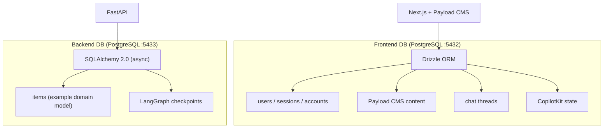
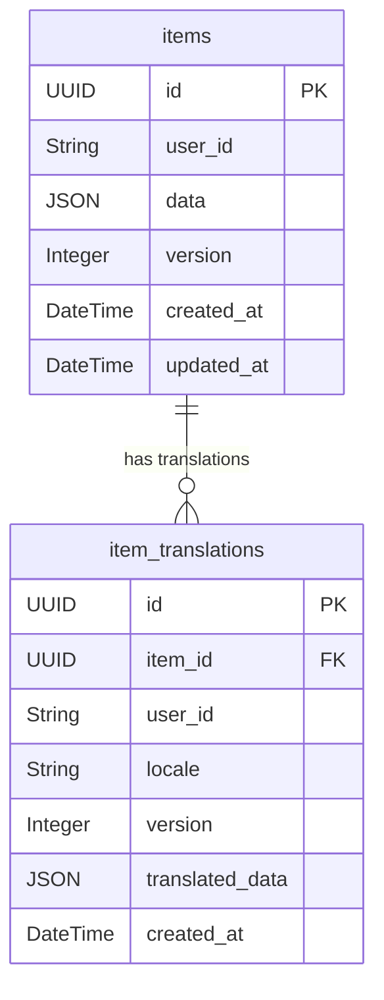

# Database Reference

## Two-Database Architecture



| Property | Frontend DB | Backend DB |
|----------|------------|------------|
| ORM | Drizzle | SQLAlchemy 2.0 (async) |
| Migration tool | Drizzle Kit | Alembic |
| Used by | Next.js, Payload CMS | FastAPI |
| Config | `apps/nextjs/drizzle.config.ts` | `apps/fastapi/alembic.ini` |
| Schema location | `apps/nextjs/src/server/db/schemas/` | `apps/fastapi/api/*/models/` |
| Port (local) | 5432 | 5433 |

## Frontend DB Schemas (Drizzle)

Located in `apps/nextjs/src/server/db/schemas/`:

- **payload-schema.ts**: Better Auth tables (users, sessions, accounts, verifications, OAuth) + Payload CMS tables
- **threads-schema.ts**: Chat thread storage (id, userId, title, timestamps)
- **copilotkit-schema.ts**: CopilotKit agent state persistence

### Frontend Migration Commands
```bash
pnpm db:generate:app    # Generate migration from schema changes
pnpm db:migrate:app     # Apply migrations
```

## Backend DB Models (SQLAlchemy)

Located in each module's `models/` directory under `apps/fastapi/api/`:

### Entity Relationship Diagram



### Models by module

| Model | Module | Table |
|-------|--------|-------|
| `Item` | `items/` | `items` |
| `ItemTranslation` | `items/` | `item_translations` |

### Backend Migration Commands
```bash
cd apps/fastapi
poetry run alembic revision --autogenerate -m "description"
poetry run alembic upgrade head
```

## Adding a New Table (TDD)

1. **Write a test first** for the CRUD operations in `apps/fastapi/__tests__/`
2. Create SQLAlchemy model in `api/{module}/models/`
3. Create Pydantic schemas in `api/{module}/schemas/`
4. Create CRUD operations in `api/{module}/crud/`
5. Generate migration: `poetry run alembic revision --autogenerate -m "add {table}"`
6. Apply migration: `poetry run alembic upgrade head`
7. **Run tests** — verify they pass

## LangGraph Checkpoints

LangGraph state is persisted in the backend DB via `agents/checkpointer.py` using `AsyncPostgresSaver` from `langgraph-checkpoint-postgres`:

- Connection pool: min 2 / max 10 connections, autocommit, `dict_row` factory
- Schema created on startup: `CREATE SCHEMA IF NOT EXISTS {DATABASE_SCHEMA}`
- Tables created via `await saver.setup()`
- Stores conversation state between requests, enabling multi-turn conversations

## Naming Conventions

| Layer | Convention | Example |
|-------|-----------|---------|
| Frontend (Drizzle) | camelCase columns | `userId`, `createdAt` |
| Backend (SQLAlchemy) | snake_case columns | `user_id`, `created_at` |
| Both | UUID primary keys | `id = Column(UUID, primary_key=True)` |
| Both | Auto timestamps | `created_at`, `updated_at` |
| Drizzle | `pgTable` definitions | `export const users = pgTable(...)` |
| SQLAlchemy | Declarative models | `class Item(Base): ...` |
