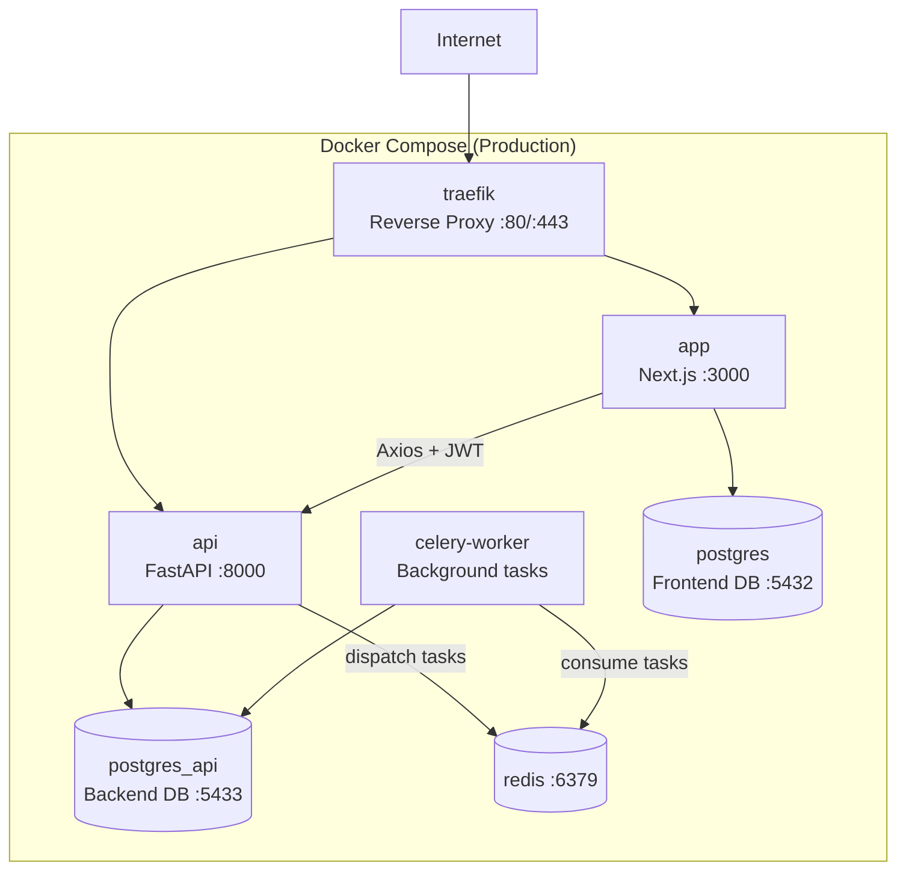
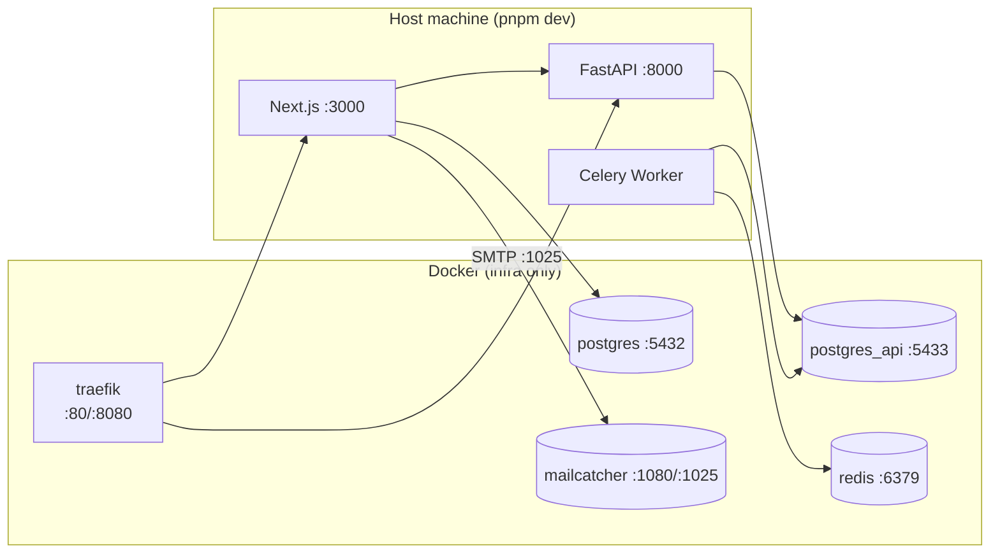

# Infrastructure Reference

## Production Architecture



## Local Development Architecture



### Prerequisites

- Node.js 20
- Python 3.12
- Docker (for PostgreSQL, Redis, MailCatcher, Traefik)

### Setup

```bash
pnpm install                    # Install all JS/TS deps
cd apps/fastapi && poetry install   # Install Python deps
docker compose -f docker-compose.local.yml up -d  # Start infra services
pnpm db:migrate                 # Run all migrations
```

### Running

```bash
pnpm dev                        # Start all apps (Turbo)
```

Or individually:

```bash
# Frontend
cd apps/nextjs && pnpm dev

# Backend
cd apps/fastapi && poetry run start

# Celery worker
cd apps/fastapi && poetry run celery-worker
```

**Local Docker services** (`docker-compose.local.yml`):

| Service | Port | Purpose |
|---------|------|---------|
| traefik | 80, 8080 | Local reverse proxy + dashboard |
| redis | 6379 | Celery broker/backend |
| postgres | 5432 | Frontend DB (Next.js/Payload) |
| postgres_api | 5433 | Backend DB (FastAPI) |
| mailcatcher | 1025 (SMTP), 1080 (web UI) | Catch outbound emails locally |

Developers run Next.js and FastAPI directly on the host — Docker is only for infrastructure services.

## Docker — Production

**Config:** `docker-compose.prod.yml`

### Services

| Service | Image | Port | Health Check |
|---------|-------|------|-------------|
| traefik | traefik:v3 | 80, 443 | — |
| postgres | pgvector/pgvector:pg15-trixie | 5432 | — |
| postgres_api | pgvector/pgvector:pg15-trixie | 5433 | — |
| redis | redis:7-alpine | 6379 | — |
| app | Custom (Next.js) | 3000 | `GET /api/health` |
| api | Custom (FastAPI) | 8000 | `GET /health` |
| celery-worker | Custom (FastAPI image) | — | — |

### Build & Deploy

```bash
docker compose -f docker-compose.prod.yml build
docker compose -f docker-compose.prod.yml up -d
```

### Dockerfiles

**`apps/nextjs/Dockerfile`** — Multi-stage Next.js build:

1. Turbo prune (only app dependencies)
2. Build with Sentry source maps (`SENTRY_AUTH_TOKEN`)
3. Minimal runner with pnpm for migrations

**`apps/fastapi/Dockerfile`** — Python FastAPI build:

1. `python:3.12-slim-bookworm` base
2. Poetry dependency install
3. `appuser` (UID 1000) for security
4. Health check via `curl localhost:8000/health`

## Environment Variables

### Where env vars are configured

| App | Config File | Validation |
|-----|------------|------------|
| Frontend | `apps/nextjs/src/env.js` | `@t3-oss/env-nextjs` + Zod |
| Backend | `apps/fastapi/api/settings.py` | Pydantic `BaseSettings` (`API_` prefix) |
| Celery | `apps/fastapi/worker/settings.py` | Pydantic `BaseSettings` |

### Required variables by service

| Service | Required Variables |
|---------|--------------------|
| app | `DATABASE_URL`, `BETTER_AUTH_SECRET`, `BACKEND_API_URL` |
| api | `API_DATABASE_URL`, `API_OAUTH_PROVIDER_URL`, `API_OPENAI_API_KEY`, `API_SECRET_KEY` |
| celery-worker | `API_DATABASE_URL`, `API_CELERY_BROKER_URL`, `API_CELERY_RESULT_BACKEND`, `API_OPENAI_API_KEY` |

### Optional observability

| Variable | Purpose |
|----------|---------|
| `API_SENTRY_DSN` | Backend error tracking |
| `NEXT_PUBLIC_SENTRY_DSN` | Frontend error tracking |
| `NEXT_PUBLIC_POSTHOG_KEY` | Product analytics |
| `NEXT_PUBLIC_POSTHOG_HOST` | PostHog proxy host |
| `API_LANGFUSE_PUBLIC_KEY` | Langfuse tracing |
| `API_LANGFUSE_SECRET_KEY` | Langfuse authentication |
| `API_LANGFUSE_BASE_URL` | Langfuse server URL |
