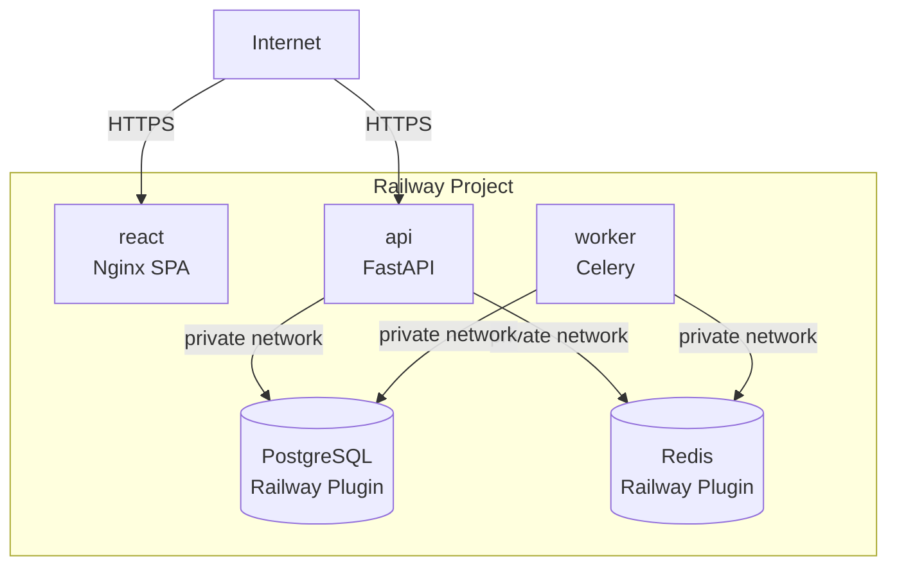
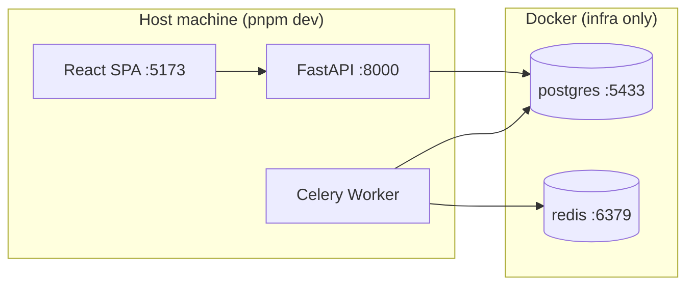

# Infrastructure Reference

## Production Architecture (Railway)



### Railway Services

| Service | Config File | Dockerfile | Start Command |
|---------|------------|------------|---------------|
| **api** | `apps/api/railway.json` | `apps/api/Dockerfile` | `poetry run start` |
| **worker** | `apps/api/railway.worker.json` | `apps/api/Dockerfile` | `poetry run celery-worker` |
| **react** | `apps/react/railway.json` | `apps/react/Dockerfile` | nginx (default) |
| PostgreSQL | Railway plugin | — | — |
| Redis | Railway plugin | — | — |

### Railway Config-as-Code

Each service has a `railway.json` that configures build and deploy settings. Config files are linked per-service in the Railway dashboard:

- **api**: Config path `/apps/api/railway.json`
- **worker**: Config path `/apps/api/railway.worker.json`
- **react**: Config path `/apps/react/railway.json`

The API service runs `alembic upgrade head` as a pre-deploy command for zero-downtime migrations.

### Railway Environment Variables

Variables are set in the Railway dashboard per service (not in config-as-code).

**API + Worker (shared variables):**

| Variable | Value |
|----------|-------|
| `API_DATABASE_URL` | `postgresql+asyncpg://` + credentials from Railway Postgres plugin |
| `API_SECRET_KEY` | Secure random token |
| `API_ENVIRONMENT` | `staging` or `production` |
| `API_APP_PASSWORD` | Shared team password |
| `API_CORS_ORIGINS` | `["https://<react-public-domain>"]` |
| `API_CELERY_BROKER_URL` | `redis://<redis-private-domain>:6379/0` |
| `API_CELERY_RESULT_BACKEND` | `redis://<redis-private-domain>:6379/0` |
| `API_R2_*` | Cloudflare R2 credentials (4 vars) |
| `API_ELEVENLABS_API_KEY` | ElevenLabs key |
| `API_ANTHROPIC_API_KEY` | Anthropic key |
| `API_GEMINI_API_KEY` | Google Gemini key |
| `API_SENTRY_DSN` | Sentry DSN (optional) |

**React:**

| Variable | Value |
|----------|-------|
| `VITE_API_URL` | `https://<api-public-domain>` |

> **Note:** Railway Postgres provides `DATABASE_URL` with `postgresql://` scheme. The API uses asyncpg which requires `postgresql+asyncpg://`. Set `API_DATABASE_URL` manually with the correct scheme.

### Deployment

Railway auto-deploys on push to the linked branch. Watch patterns in each `railway.json` prevent unnecessary rebuilds:

- **api/worker**: Only rebuild when `apps/api/**` changes
- **react**: Rebuild when `apps/react/**`, `packages/**`, or `tooling/**` change

CI/CD pipelines (`.github/workflows/pipe-*.yml`) handle Sentry releases after Railway deploys.

## Local Development Architecture



### Prerequisites

- Node.js 20
- Python 3.12
- Docker (for PostgreSQL, Redis)

### Setup

```bash
pnpm install                    # Install all JS/TS deps
cd apps/api && poetry install   # Install Python deps
docker compose -f docker-compose.local.yml up -d  # Start infra services
pnpm db:migrate                 # Run all migrations
```

### Running

```bash
pnpm dev                        # Start all apps (Turbo)
```

Or individually:

```bash
# Frontend
cd apps/react && pnpm dev

# Backend
cd apps/api && poetry run start

# Celery worker
cd apps/api && poetry run celery-worker
```

**Local Docker services** (`docker-compose.local.yml`):

| Service | Port | Purpose |
|---------|------|---------|
| redis | 6379 | Celery broker/backend |
| postgres | 5433 | Database (FastAPI) |

## Environment Variables

### Where env vars are configured

| App | Config File | Validation |
|-----|------------|------------|
| Frontend | `apps/react/src/env.ts` | `@t3-oss/env-core` + Zod |
| Backend | `apps/api/api/settings.py` | Pydantic `BaseSettings` (`API_` prefix) |

### Required variables by service

| Service | Required Variables |
|---------|--------------------|
| api | `API_DATABASE_URL`, `API_SECRET_KEY` |
| celery-worker | `API_DATABASE_URL`, `API_CELERY_BROKER_URL`, `API_CELERY_RESULT_BACKEND` |

### Pipeline API keys

| Variable | Purpose |
|----------|---------|
| `API_R2_ACCOUNT_ID` | Cloudflare R2 account |
| `API_R2_ACCESS_KEY_ID` | R2 access key |
| `API_R2_SECRET_ACCESS_KEY` | R2 secret key |
| `API_R2_BUCKET_NAME` | R2 bucket (default: `video-pipeline`) |
| `API_ELEVENLABS_API_KEY` | Text-to-speech |
| `API_ANTHROPIC_API_KEY` | Claude segmentation |
| `API_GEMINI_API_KEY` | Image generation |

### Optional observability

| Variable | Purpose |
|----------|---------|
| `API_SENTRY_DSN` | Backend error tracking |
| `NEXT_PUBLIC_SENTRY_DSN` | Frontend error tracking |
| `NEXT_PUBLIC_POSTHOG_KEY` | Product analytics |
